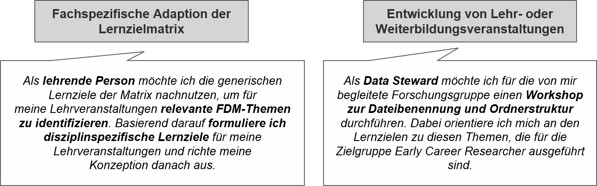
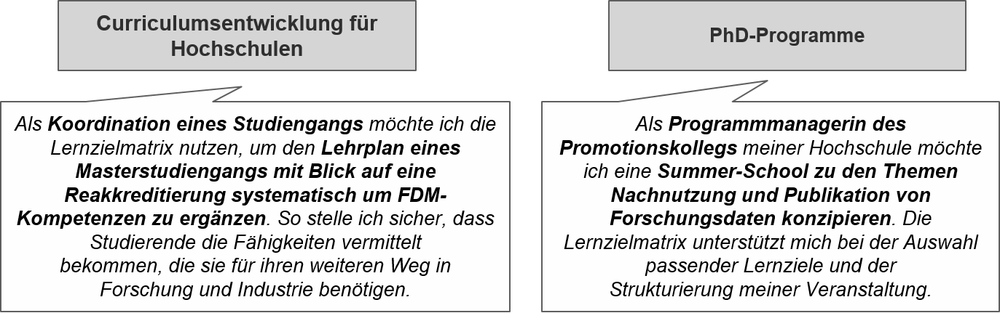
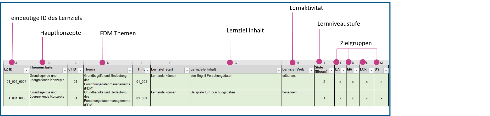
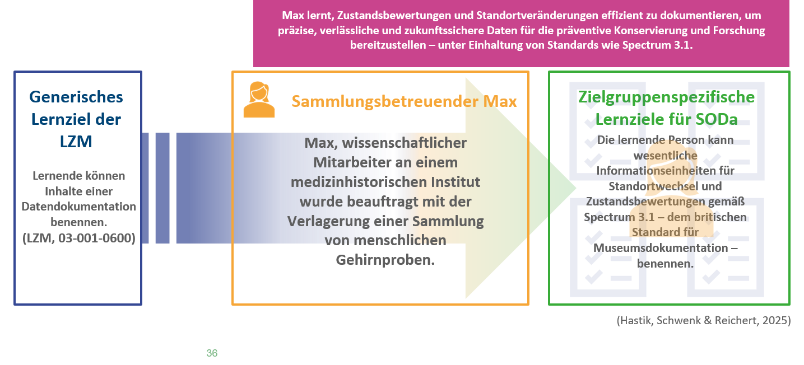
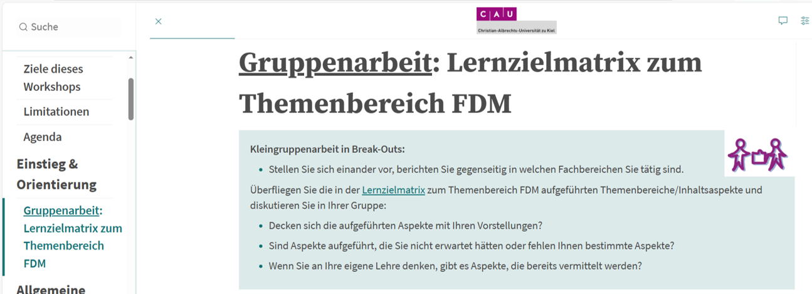
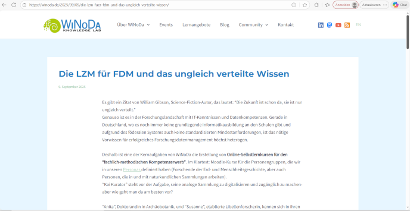

<!--

author: Britta Petersen  
email: b.petersen@rz.uni-kiel.de   
version:  1.0
language: de
narrator: Deutsch Female
title: You take the red pill – and I show you how deep the learning goes

icon: https://www.uni-kiel.de/ps/cgi-bin/logos/files/cau/norm-en/cau-norm-en-blacklila-rgb-0720.png

link: https://raw.githubusercontent.com/RDM4CAU/Intro-to-RDM/refs/heads/main/cau-style.css

licence: https://creativecommons.org/licenses/by/4.0/

-->

# Take the red pill... 💊
<!-- style="background-color: #F2F2F2; width: 15%; height: 10%; float: right;" -->


<!-- style="width: 85%; height: 10%; float: left; padding: 15px; font-size: 21px; text-align: left; background-color:rgb(0, 0, 0); color: lime; font-family: 'Exo 2', monospace" -->
***...and I show you how deep the learning goes.***

***Die Lernzielmatrix zum Forschungsdatenmanagement als Werkzeug für die strukturierte Entwicklung von FDM-Bildungsangeboten.***<!-- style="width: 100%; float: left; padding: 130px; font-size: 35px; font-family: 'Exo 2', monospace; text-align: center; background-color: #bfefff" -->
<br>
<br>
<br>
<br>
[Britta Petersen](https://orcid.org/0000-0002-0355-2594) | FDM-SH Datenhorizonte 2025-12-01 | Unless otherwise stated this work is licenced under [CC BY 4.0](https://creativecommons.org/licenses/by/4.0/)

<div style="page-break-after: always;"></div>

# Lernzielmatrix FDM 👩‍🏫
<!-- style="background-color: #F2F2F2; width: 15%; height: 12%; float: right;" -->


<!-- style="width: 85%; height: 12%; float: left; padding: 15px; font-size: 21px; text-align: left; background-color:rgb(0, 0, 0); color: lime; font-family: 'Exo 2', monospace" -->
***"No one can be told what the Matrix is. You have to see it for yourself." – Morpheus***


<div style="page-break-after: always;"></div>

## Was ist das?
<div style="width: 25%; float: right; background-color: #bfefff; padding: 20px;">

</div>

<div style="width: 75%; float: left; background-color: #bfefff; text-indent: 5px; padding: 15px; font-size: 25px">

**Die Lernzielmatrix zum FDM...**

- ... ist ein **Orientierungswerkzeug**, welches für das FDM relevante Themen und hierzu passende Lernziele für verschiedene Zielgruppen Lernender in einer strukturierten Form zusammenfasst.
</div>

<div style="width: 100%; float: left; background-color: #bfefff; text-indent: 5px; padding: 15px; font-size: 25px">
- ...orientiert sich an einer Reihe von (inter-)nationalen Projekten und Fortbildungskonzepten.

- ...ist ein fortlaufend weiterzuentwickelndes Produkt der FDM-(Trainings-)Community.

- ...verfolgt einen generischen Ansatz und ermöglicht damit eine Anwendung und Adaption über die Fach- und Organisationsgrenzen hinweg.

</div>

## Ziel
<!-- style="width: 100%; float: left; padding: 20px; font-size: 25px; text-align: left; background-color: #bfefff" -->
**Die LZM-FDM verfolgt das Ziel...**

<div style="width: 100%; float: left; background-color: #bfefff; padding: 20px; font-size: 25px">

- **ein gemeinsames Verständnis** für relevante Themen und Inhalte im Bereich FDM  zu erarbeiten und festzuhalten.

- **eine Hilfestellung für eine effektive Auswahl von möglichen Lehr/Lerninhalten** bereitzustellen.

- **eine Hilfestellung für eine Strukturierung von Lehr-/Lerninhalten** zu bieten.

- **eine Hilfestellung** in der **Qualifizierung von ausbildenden Personen** zu bieten.

- einen Beitrag zur **Qualitätssicherung** von Lehr/Lernmaterialien oder Schulungskonzepten zu leisten.

</div>

<div style="page-break-after: always;"></div>

## Adressaten

{{0-1}}
**************
<!-- style="width: 100%; float: left; padding: 20px; font-size: 25px; text-align: left; background-color: #bfefff" -->
**Adressierte Personengruppen...**

<div style="width: 100%; float: left; background-color: #bfefff; padding: 20px; font-size: 25px">
...sind bspw. **FDM-Multiplikator:innen** oder **Lehrende der Fachbereiche**, die die Matrix auf ihre Kontexte anwenden, z. B. für die Entwicklung von:

- FDM-Informationsveranstaltungen
- FDM-Trainings/Schulungen
- FDM-Lehr/Lernmaterialien
- Integration von FDM-Inhalten in bestehende Lehrveranstaltungen
- Integration von FDM-Inhalten in Curricula oder Modulbeschreibungen 

</div>

*****************

{{1}}
*****************

<!-- style="width: 100%; float: left; padding: 20px; font-size: 25px; text-align: left; background-color: #bfefff" -->
**Nutzungsszenarien**

<!-- style="width: 60%" -->


<!-- style="width: 60%" -->


*****************

## Entwicklung

<!-- style="width: 100%; float: left; padding: 20px; font-size: 25px; text-align: left; background-color: #bfefff" -->
**Die Matrix ist ein Produkt der Community!**

<div style="width: 100%; float: left; background-color: #bfefff; padding: 20px; font-size: 25px">

- [**Version 1, de**](https://doi.org/10.5281/zenodo.7034478): Veröffentlichung 2022
- [**Version 2, de/en**](https://zenodo.org/records/8010617): Veröffentlichung 2023
- [**Version 3, de**](https://doi.org/10.5281/zenodo.15025246):

  - Community-Event in Darmstadt, 2024
  - Redaktionssitzungen und Call4Comments
  - Veröffentlichung im März 2025

- [**Version 3, en**](https://zenodo.org/records/15846806): Publikation im September 2025  

</div>

<div style="page-break-after: always;"></div>

## Lernziele

{{0-1}}
************

<!-- style="width: 100%; float: left; padding: 20px; font-size: 25px; text-align: left; background-color: #bfefff" -->
**Warum eigentlich Lernziele?**

<div style="width: 40%; float: right; background-color: #bfefff; padding: 12px;">

``` ascii

         Ziel🎯
          /\
         /  \
        /____\
  Zeit⏳       Zielgruppe👥
```

</div>

<div style="width: 60%; float: left; background-color: #bfefff; padding: 20px;font-size: 25px">
Bei der Planung von Lehre müssen immer drei wichtige Fragen beantwortet werden:

- **Was ist das Ziel?**
- Wer ist die Zielgruppe?
- Wie viel Zeit steht zur Verfügung?
</div>

************

<div style="page-break-after: always;"></div>

{{1-2}}
************
<!-- style="width: 100%; float: left; padding: 20px; font-size: 25px; text-align: left; background-color: #bfefff" -->
**Was ist ein Lernziel?**

<!-- style="width: 100%; height: 100%; float: left; padding: 25px; font-size: 20px; text-align: center; background-color: #bfefff" -->
***Ein Lernziel beschreibt den nachprüfbaren Zuwachs an Kenntnissen, Fertigkeiten und Haltungen bezogen auf einen bestimmten Lerninhalt, der am Ende eines Lernprozesses erreicht werden soll.***<!-- style="font-size: 30px" -->
<br>
<br>
[Glossar der Lernzielmatix zum Forschungsdatenmanagement](https://skohub.io/dini-ag-kim/fdm-lernziele/heads/main/w3id.org/kim/fdm-glossar/lzm0029.html)

****************

{{2-3}}
*****************
<!-- style="width: 100%; float: left; padding: 20px; font-size: 25px; text-align: left; background-color: #bfefff" -->
**Mit anderen Worten: Lernziele...**

<!-- style="width: 100%; height: 100%; float: left; padding: 25px; font-size: 25px; text-align: left; background-color: #bfefff" -->
🎯 *...bieten Orientierung zu den Themen, die in einer bestimmten Lehr-/Lerneinheit behandelt werden, und*<!-- style="font-size: 25px" -->
<br>
<br>
🎯 *...beschreiben, was Lernende nach Abschluss einer bestimmten Lehr-/Lerneinheit können sollten.*<!-- style="font-size: 25px" -->

**************

<div style="page-break-after: always;"></div>

{{3-4}}
***************
<!-- style="width: 100%; float: left; padding: 20px; font-size: 25px; text-align: left; background-color: #bfefff" -->
**Klare und effiziente Lernziele...**

<div style="width: 100%; float: left; padding: 25px; font-size: 23px; text-align: left; background-color: #bfefff">

🎯 ...beschreiben ein beobachtbares und messbares Verhalten.

🎯 ...verwenden keine vagen Verben wie „verstehen” oder „wissen”.

🎯 ...verwenden vorzugsweise ein möglichst eindeutiges Verb pro Lernziel

  - -> hierfür existieren diverse Listen, z. B. [hier](https://wb-web.de/material/methoden/formulierungshilfen-fur-lernziele.html)

🎯 ...sind aus der Perspektive der Lernenden geschrieben: __Wer__ sollte unter *welchen Bedingungen* __was__ können.

</div>

*************

{{4}}
***************

<div style="width: 100%; float: left; padding: 20px; font-size: 25px; text-align: left; background-color: #bfefff;">
**Beispiel:**

| Klares Lernziel | Unklares Lernziel |  
| :---- | :---- |  
| benennen, erläutern, anwenden, analysieren, bewerten, entwerfen | kennen, verstehen, vertraut sein mit, informiert sein über |  
| **Beispiel**: Lernende können die FAIR-Prinzipien erläutern. ✅ | **Beispiel**: Lernende verstehen die FAIR-Prinzipien. ❌ |
</div>

<div style="width: 100%; float: left; padding: 20px; font-size: 15px; text-align: left; background-color: #bfefff;">
**siehe auch**: Manske, A., & Petersen, B. (2025). 23 TrainingThings for Writing Learning Objectives. Zenodo. https://doi.org/10.5281/zenodo.15043810 

</div>

***********

<div style="page-break-after: always;"></div>

## Materialien
<div style="width: 100%; float: left; background-color: #bfefff; font-size: 30px; padding: 15px;">

{{0-1}}
************
**Materialien:**

<!-- style="width: 75%" -->
*************

</div>


{{1-2}}
************
<div style="width: 100%; float: left; background-color: #bfefff; font-size: 50px; padding: 15px">
**Try to check out README first :-)**
</div>

*************

{{2-3}}
************
<!-- style="padding: 15px; font-size: 30px; text-align: left; background-color: #bfefff" -->
**Lernziele in Themenclustern:**

<div style="width: 100%; float: left; background-color: #bfefff; padding: 20px; font-size: 25px">

- Grundlegende und übergreifende Konzepte (201)
- Arbeiten mit Daten (396)
- Dokumentation und Metadaten (203)
- Archivierung, Publikation, Nachnutzung (98)
- Recht und Ethik (202)
- Metakompetenzen (99)

</div>

*************

{{3}}
************
<div style="background-color: #bfefff; font-size: 30px; padding: 15px">

**Ein Blick in das Tabellenblatt Lernziele: 🔎**

</div>

<div style="background-color: #bfefff; padding: 15px">


- Alle Lernziele sind sprachlich einheitlich aufgebaut.
- Die Lernziele sind thematisch geordnet, ihre Reihenfolge innerhalb der Themen ist jedoch zufällig!

</div>

************

### Glossar
<iframe src="https://skohub.io/dini-ag-kim/fdm-lernziele/heads/main/w3id.org/kim/fdm-glossar.html" width="100%" height="600" style="border: 2px solid black;"></iframe>

<div style="page-break-after: always;"></div>

## How to use

{{0-1}}
*************

Nutzung der Lernzielmarix als Orientierungswerkzeug
---

<div style="width: 20%; float: right; padding: 12px;">

``` ascii

         Ziel🎯
          /\
         /  \
        /____\
  Zeit⏳       Zielgruppe👥
```

</div>

>✅ Auswahl an relevanten Themen/Inhalten
>
>✅ Auswahl der für den eigenen Einsatz geeigneten Lernziele
>
>✅ Hierarchische Strukturierung der ausgewählten Lernziele

>**Ggf. Ergänzung von fach-, zielgruppen oder veranstaltungsspezifischen Bedingungen:**
>
>✅ Ergänzung fach- oder zielgruppenspezifischer Bedingungen (z. B. „für OMICS-Daten“).
>
>✅ Festlegung von Leistungsbedingungen (z. B. „eigenständig“, „schriftlich“, "in Form einer Projektarbeit").
>
>✅ Zeitvorgaben (z. B. „innerhalb von 30 Minuten“).
>
>✅ Erfolgskriterien (z. B. „nennt mindestens 5 Beispiele“).
>
>✅ ...

*************

{{1-2}}
*************

<div style="width: 100%; float: left; padding: 10px; font-size: 18px; text-align: left; background-color: #f0daec;">

Beispiele für Anpassungen von Lernzielen
---

| Lernziel  | Mögliche Umsetzung |
| :---- | :---- |
| Lernende können die Funktionen und Verantwortlichkeiten von Personen im Forschungsdatenmanagement (FDM) erläutern. (LZM-ID 01\_03\_033) | -> Lernende können die Funktionen und Verantwortlichkeiten von **Konservatoren und Restauratoren** erläutern. (Hastik & Schwenk, 2025) |
|  | -> Lernende können die Funktionen und Verantwortlichkeiten von **Data Stewards** im Forschungsdatenmanagement (FDM) **anhand eines in Gruppenarbeit erstellten Diagramms** erläutern. |
|  | -> Lernende können die Funktionen und Verantwortlichkeiten von **PIs, einzelnen Forschenden und embedded Data Stewards** für das Forschungsdatenmanagement (FDM) des Sonderforschungsbereichs XYZ **zunächst in kleinen Gruppen und anschließend in einer Plenumssitzung** diskutieren. |
| Lernende können die Phasen des Forschungsdatenlebenszyklus erläutern. (LO-ID 01_005\_0080) | -> Lernende können die Phasen des Forschungsdatenlebenszyklus **in der sozialwissenschaftlichen Forschung** erklären. |
|  | -> Lernende können die Phasen des Forschungsdatenlebenszyklus **in Bezug auf ein selbst gewähltes, für die Forschung in der Chemie typisches Beispiel** beschreiben. |
|  | -> Lernende können die Phasen des Forschungsdatenlebenszyklus **in Bezug auf die Erstellung einer digitalen Edition in schriftlicher Form** erläutern. |

</div>

*************

{{2}}
*************

<div style="width: 100%; float: left; padding: 20px; font-size: 23px; text-align: left; background-color: #bfefff; border: 2px solid white">
**✅ Nutzt die Matrix als Inspirationsquelle und entwickelt hieraus eigene Lernziele!**</div>

**********

<div style="page-break-after: always;"></div>

## Praxisbeispiele

{{0-1}}
***********
Mit V3 der Matrix wurden Anwendungsbeispiele aus der Praxis zusammengetragen.

Die Beispiele aus der Praxis zeigen die bereits umfangreiche Nutzung der Matrix und können als Inspiration für Nachnutzende dienen.

<!--style="width: 80%" -->


******************

{{1-2}}
******************

<!--style="font-size: 25px" -->
Das Datenkompetenzzentrum [SODa](https://sammlungen.io/)


******************

{{2-3}}
***************
<!--style="font-size: 25px" -->
DMP4NFDI [DMP4NFDI](https://dmp.services.base4nfdi.de/)

[DMP4NFDI Train-the-Trainer Concept on Data Management Plans and RDMO](https://zenodo.org/records/15771036)

<!--style="width: 90%" -->


***************

{{3-4}}
***************
<!--style="font-size: 25px" -->
Beispiel für eigene Nutzung: Einsatz in Workshops



***************

{{4}}
***************

<!--style="font-size: 25px" -->
[Blog-Beitrag Datenkompetenzzntrum WiNoDa](https://winoda.de/en/2025/09/09/the-lom-for-rdm-and-the-unevenly-distributed-knowledge/)




****************

<div style="page-break-after: always;"></div>


# Weiterentwicklung & Community
<!-- style="background-color: #F2F2F2; width: 15%; height: 12%; float: right;" -->


<!-- style="width: 85%; height: 12%; float: left; padding: 15px; font-size: 21px; text-align: left; background-color:rgb(0, 0, 0); color: lime; font-family: 'Exo 2', monospace" -->
🔸 ***"We’re all here to do what we’re all here to do." – The Oracle***

{{0-1}}
*******************

<div style="width: 100%; float: left; padding: 20px; font-size: 25px; text-align: left; background-color: #bfefff; border: 2px solid white">
**Still a lot to do!**<!-- style="font-size: 30px;" -->

✅ seit September 2025: Übersetzung von Version 3 ins Englische

🔸 Kontinuierlicher Austausch mit Projekten und der Community

🔸 Anschluss an europäische Initiativen, z. B. Skills4EOSC

🔸 Cluster- und Themenbezeichnungen in kontrollierten Vokabularen

🔸 Verbesserung der Interoperabilität, z. B. Modellierung in [skos](https://www.w3.org/2004/02/skos/)

🔸 Aktualisierung und Erweiterung von Themen (z. B. KI, Critical Thinking)  sowie kontinuierliche Pflege

</div>

*******************

{{1}}
*********************

<div style="width: 100%; float: left; padding: 20px; font-size: 25px; text-align: left; background-color: #bfefff; border: 2px solid white">
**Become part of the Matrix!**<!-- style="font-size: 30px;" -->

✅ Mitgliedschaft in [DINI/nestor AG Forschungsdaten UAG Schulungen/Fortbildungen](https://www.forschungsdaten.org/index.php/UAG_Schulungen/Fortbildungen)

✅ Mitwirkung via [Sektion Training & Education](https://www.nfdi.de/section-edutrain/)

✅ Eigene Anwendungsbeispiele teilen (z. B. via [LZM-info-page](https://www.forschungsdaten.org/index.php/Lernzielmatrix) @ forschungsdaten.org)

✅ via GitHub: https://github.com/dini-ag-kim/fdm-lernziele

✅ Diskussion und Austausch, z. B. hier :-)

</div>

******************

<div style="page-break-after: always;"></div>

# Danke 💖
<!-- style="background-color: #bfefff; width: 15%; height: 12%; float: right;" -->


<!-- style="width: 85%; height: 12%; float: left; padding: 15px; font-size: 21px; text-align: left; background-color:rgb(0, 0, 0); color: lime; font-family: 'Exo 2', monospace" -->
***"There is a difference between knowing the path and walking the path." – Morpheus***

<div style="width: 100%; float: left; padding: 15px; font-size: 35px; text-align: left; background-color: #F2F2F2;">
Thank you for your attention!

Many thanks to the community and everyone involved!
</div>

<!-- style="width: 40%; float: right; padding: 5px; font-size: 14px; text-align: left; background-color: #F2F2F2;" -->


<!-- style="width: 60%; float: left; padding: 25px; font-size: 16px; text-align: left; background-color: #F2F2F2;" -->
***Franziska Altemeier***, [ORCID: 0000-0001-7086-6211](https://orcid.org/0000-0001-7086-6211); ***Sophie Boße***, [ORCID: 0009-0002-6461-8291](https://orcid.org/0009-0002-6461-8291); ***Nina Düvel***, [ORCID: 0000-0003-0877-0483](https://orcid.org/0000-0003-0877-0483); ***Claudia Engelhardt***, [ORCID: 0000-0002-3391-7638](https://orcid.org/0000-0002-3391-7638); ***Mark Fichtner***, [ORCID: 0000-0001-5597-4222](https://orcid.org/0000-0001-5597-4222); ***Canan Hastik***, [ORCID: 0000-0003-1729-4642](https://orcid.org/0000-0003-1729-4642); ***Jan-Michael Haugwitz***, [ORCID: 0009-0007-3576-3947](https://orcid.org/0009-0007-3576-3947); ***Juliane Jacob***, [ORCID: 0000-0002-0443-3570](https://orcid.org/0000-0002-0443-3570); ***Katharina Koch***, [ORCID: 0000-0002-7455-2874](https://orcid.org/0000-0002-7455-2874); ***Alessandra Kuntz***, [ORCID: 0000-0002-8259-2577](https://orcid.org/0000-0002-8259-2577); ***Antje Manske***, [ORCID: 0009-0001-0248-4462](https://orcid.org/0009-0001-0248-4462); ***Andreas Mühlichen***, [ORCID: 0000-0003-3115-4021](https://orcid.org/0000-0003-3115-4021); ***Jorge Murcia Serra***, [ORCID: 0000-0003-3062-7376](https://orcid.org/0000-0003-3062-7376); ***Jochen Ortmeyer***, [ORCID: 0000-0003-2074-8027](https://orcid.org/0000-0003-2074-8027); ***Manuela Richter***, [ORCID: 0000-0003-1060-2622](https://orcid.org/0000-0003-1060-2622); ***Hermann Schranzhofer***, [ORCID: 0000-0003-0249-2726](https://orcid.org/0000-0003-0249-2726); ***Benjamin Slowig***, [ORCID: 0000-0001-5343-2788](https://orcid.org/0000-0001-5343-2788); ***Ute Trautwein-Bruns***, [ORCID: 0000-0003-0531-0182](https://orcid.org/0000-0003-0531-0182); ***Dorothee Urbaum***, [ORCID: 0009-0003-5711-6303](https://orcid.org/0009-0003-5711-6303); ***Anne Voigt***, [ORCID: 0000-0002-2873-3201](https://orcid.org/0000-0002-2873-3201); ***Stephanie Werner***, [ORCID: 0000-0002-0468-8856](https://orcid.org/0000-0002-0468-8856); ***Cord Wiljes***, [ORCID: 0000-0003-2528-5391](https://orcid.org/0000-0003-2528-5391); ***Linda Zollitsch***, [ORCID: 0000-0001-9592-3382](https://orcid.org/0000-0001-9592-3382); authors in earlier versions: **Tanja Hörner***, [ORCID: 0000-0003-3280-6941](https://orcid.org/0000-0003-3280-6941), ***Tatiana Kvetnaya*** [ORCID: 0000-0002-5477-1199](https://orcid.org/0000-0002-5477-1199), ***Sandra Schulz***, [ORCID: 0000-0002-2254-6579](https://orcid.org/0000-0002-2254-6579)

<div style="page-break-after: always;"></div>

# Quellen

Emojis used were designed by [OpenMoji – the open-source emoji and icon project](https://openmoji.org/). License: [CC BY SA 4.0](https://creativecommons.org/licenses/by-sa/4.0/#)

EOSC-synergy. Data Steward Training. https://learn.eosc-synergy.eu/data-steward-training/, visited 29.03.2025

Hastik, C., & Schwenk, G. A. (2025). SODa BeratungsCamp Modul 1 \- Arbeiten mit strukturierten Daten in der Konservierungs- und Restaurierungsdokumentation \- Didaktisches Konzept (Version 1). Zenodo. [https://doi.org/10.5281/zenodo.14860999](https://doi.org/10.5281/zenodo.14860999)

Manske, A., & Petersen, B. (2025). 23 TrainingThings for Writing Learning Objectives. Zenodo. https://doi.org/10.5281/zenodo.15043810

Petersen, B., Altemeier, F., Boße, S., Düvel, N., Engelhardt, C., Fichtner, M., Hastik, C., Haugwitz, J.-M., Jacob, J., Koch, K., Kuntz, A., Manske, A., Mühlichen, A., Murcia Serra, J., Ortmeyer, J., Richter, M., Schranzhofer, H., Slowig, B., Trautwein-Bruns, U., … Zollitsch, L. (2025). Lernzielmatrix zum Themenbereich Forschungsdatenmanagement (FDM) (Version 3). Zenodo. https://doi.org/10.5281/zenodo.15025246

The Turing Way Community. (2022). The Turing Way: A handbook for reproducible, ethical and collaborative research (1.0.2). Zenodo. https://doi.org/10.5281/zenodo.7625728

White, A., & Green, D. (2025). Data Steward: Minimum Viable Skills Profile. Zenodo. https://doi.org/10.5281/zenodo.14865959
