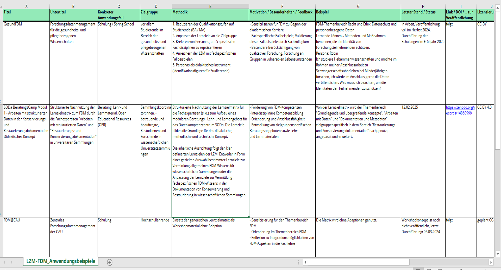

<!--

author: Britta Petersen  
email: b.petersen@rz.uni-kiel.de   
version:  1.0
language: en
narrator: Deutsch Female
title: A visit from the Matrix: Learning Objectives as a Starting Point for the Development of Trainings for (Future) Data Stewards

icon: https://www.uni-kiel.de/ps/cgi-bin/logos/files/cau/norm-en/cau-norm-en-blacklila-rgb-0720.png

licence: https://creativecommons.org/licenses/by/4.0/

-->

# MATRIX 💊 meets Fellows of the Data 🧙‍♂️
<!-- style="background-color: #F2F2F2; width: 15%; height: 8%; float: right;" -->

<!-- style="width: 85%; float: left; padding: 15px; font-size: 21px; text-align: left; background-color:rgb(0, 0, 0); color: lime; font-family: 'Exo 2', monospace" -->
***“The Matrix is everywhere. It is all around us.” – Morpheus***

***Learning Objectives as a Starting Point for the Development of Trainings for (Future) Data Stewards***<!-- style="width: 100%; float: left; padding: 180px; font-size: 35px; font-family: 'Exo 2', monospace; text-align: center; background-color: #bfefff" -->
 
 
 
 
 
 
 
 
 
 
Britta Petersen | Fellowship of the Data 2025, Jena | Unless otherwise stated this work is licenced under [CC BY 4.0](https://creativecommons.org/licenses/by/4.0/)

# Data Stewards 🧙‍♂️
<!-- style="width: 15%; height: 8%; float: right;" -->

<!-- style="width: 85%; float: left; padding: 15px; font-size: 21px; text-align: left; background-color:rgb(0, 0, 0); color: lime; font-family: 'Exo 2', monospace" -->
***"What is real? How do you define ‘real’?"*** – Morpheus

<!-- style="width: 25%; height: 20%; float: right; font-size: 25px; text-align: left; background-color: #bfefff" -->

{{1}}
***************

<!-- style="width: 74%; height: 45%; float: left; padding: 15px; font-size: 25px; text-align: left; background-color: #bfefff;" -->
‘Data Steward’ is an umbrella term for numerous support roles that involve the creation, management and usage of research data.
\
\
**🧚 - 🧪 - 🧙‍♂️ - 🧬 - 🧝 - 👩‍💻 - 📚 - 🧝‍♂️ - 📊 - 🧙‍♀️**<!-- style="font-size: 30px; margin-left: 10%" -->
\
\
**The scope of responsibilities can vary significantly between individual Data Stewards, depending on their institution, domain, and expertise.**
\

***************

{{2}}
***************
<!-- style="width: 100%; height: 20%; float: left; padding: 15px; font-size: 30px; text-align: left; background-color: #bfefff; border: 2px black" -->
**The high diversity of responsibilities for Data Stewards is a particular challenge in the development of training programmes. 👉 👩‍🏫**

***************

## Key responsibilities of Data Stewards
<!-- style="background-color: #F2F2F2; width: 15%; height: 8%; float: right;" -->

<!-- style="width: 85%; float: left; padding: 15px; font-size: 21px; text-align: left; background-color:rgb(0, 0, 0); color: lime; font-family: 'Exo 2', monospace" -->
***"You take the red pill... and I show you how deep the rabbit hole goes."*– Morpheus**

<!-- style="width: 30%; float: right; padding: 5px;" -->
. Data Steward: Minimum Viable Skills Profile. Zenodo. https://doi.org/10.5281/zenodo.14865959")

**Data Stewards need both domain-specific expertise and cross-disciplinary skills.**

`Consulting` - advising on metadata, repositories, Open Science, FAIR principles, archiving, storage, funder requirements *and quite a lot more!!!*<!-- style="color: red" -->

`Communication` – translating technical concepts for researchers.

`Didactics` – designing and delivering effective training.

`Project management` – coordinating data initiatives.

`Change management` – driving cultural and organizational shifts in RDM.

# Learning Objectives 🎯
<!-- style="background-color: #F2F2F2; width: 15%; height: 8%; float: right;" -->

<!-- style="width: 85%; float: left; padding: 15px; font-size: 21px; text-align: left; background-color:rgb(0, 0, 0); color: lime;" -->
***"I know Kung Fu." – Neo***

{{0-1}}
************
<!-- style="width: 100%; height: 100%; float: left; padding: 25px; font-size: 20px; text-align: center; background-color: #bfefff" -->
*The term learning objective can be defined as:*
 
 
***A learning objective describes the ~~verifiable~~ ~~increase~~ in ~~knowledge~~, ~~skills~~ and ~~attitudes~~ in relation to a specific ~~learning content~~, which should be achieved ~~at the end of a learning process~~.***<!-- style="font-size: 30px" -->
 
 
[Glossar der Lernzielmatix zum Forschungsdatenmanagement](https://skohub.io/dini-ag-kim/fdm-lernziele/heads/main/w3id.org/kim/fdm-glossar/lzm0029.html)

****************

{{1}}
*****************
<!-- style="width: 100%; height: 100%; float: left; padding: 25px; font-size: 30px; text-align: left; background-color: #bfefff" -->
**In other words, learning objectives...**
 
 
🎯 *provide information on the topics covered in a certain teaching/learning unit and*<!-- style="font-size: 28px" -->
 
 
🎯 *outline what learners should be able to do after completing a certain teaching/learning unit.*<!-- style="font-size: 28px" -->

**************

## Effective learning objectives
<!-- style="width: 15%; height: 8%; float: right;" -->

<!-- style="width: 85%; float: left; padding: 15px; font-size: 21px; text-align: left; background-color:rgb(0, 0, 0); color: lime;" -->
***"I ~know~ Kung Fu." – Neo***

**Clear and effective learning objectives...**

{{1-5}}
************
🎯 ...describe an observable behavior that is “measurable”.
************

{{2-5}}
************
🎯 ...use preferably one action verb per learning objective aligned with Bloom's Taxonomy.
************

{{3-5}}
************
🎯 ...avoid using vague terms like "understand" or "know”.
************

{{4-5}}
************
🎯 ...are written from learners' perspective: *Who should be able to do what under which conditions*.
************

{{5}}
***************

**Example:**

| Clear learning objective | Unclear learning objective |  
| :---- | :---- |  
| name, explain, apply, analyze, evaluate, design | know, understand, be familiar with, be informed about |  
| **Example**: Learners can explain the FAIR principles. ✅ | **Example**: Learners understand the FAIR principles. ❌ |

***********

## LOs in training development
<!-- style="width: 15%; height: 8%; float: right;" -->

<!-- style="width: 85%; float: left; padding: 15px; font-size: 21px; text-align: left; background-color:rgb(0, 0, 0); color: lime;" -->
***"I ~know~ Kung Fu." – Neo***

<!-- style="width: 100%; float: left; padding: 25px; font-size: 30px; text-align: left; background-color: #bfefff" -->
**Learning objectives support training development as they...**

{{1}}
************
🎯 **provide a shared understanding** of a training’s focus.
************
{{2}}
************
🎯 **help to develop a clear structure** for training design.
************
{{3}}
************
🎯 **help align** training with **desired competencies**.
************
{{4}}
************
🎯 **support learners in understanding** expectations and tracking progress.
************
{{5}}
************
🎯 **enable assessment** of learning outcomes and supports **selection of assessment methods**.
************
{{6}}
************
🎯 **guide instructors in selecting** appropriate **teaching methods**.
************
{{7}}
************
🎯 **enhance consistency and quality assurance** by providing a structured framework.
************

# Matrix of LO for RDM 👩‍🏫
<!-- style="background-color: #F2F2F2; width: 15%; height: 8%; float: right;" -->

<!-- style="width: 85%; float: left; padding: 15px; font-size: 21px; text-align: left; background-color:rgb(0, 0, 0); color: lime; font-family: 'Exo 2', monospace" -->
***"No one can be told what the Matrix is. You have to see it for yourself." – Morpheus***

<iframe src="https://zenodo.org/records/15025246m" width="100%" height="600" style="border: 2px solid black;"></iframe>

## Purpose
<!-- style="background-color: #F2F2F2; width: 15%; height: 8%; float: right;" -->

<!-- style="width: 85%; float: left; padding: 15px; font-size: 21px; text-align: left; background-color:rgb(0, 0, 0); color: lime; font-family: 'Exo 2', monospace" -->
***It is all around us. Even now, in this very room." – Morpheus***

<!-- style="width: 100%; float: left; padding: 25px; font-size: 30px; text-align: left; background-color: #bfefff" -->
**The learning objectives matrix for RDM wants to...**

{{1}}
************
🎯 **provide a shared understanding** of relevant topics in RDM.
************
{{2}}
************
🎯 **provide a guide for effective content selection**.
************
{{3}}
************
🎯 **help to structure learning content**, including complexity levels and areas of expertise.
************
{{4}}
************
🎯 **enable assessment** and support **selection of assessment methods**.
************
{{5}}
************
🎯 **support the selection of teaching methods** and the **planning of learning activities**.
************
{{6}}
************
🎯 **supports** the **qualification of trainers**.
************
{{7}}
************
🎯 **enhance consistency and quality assurance** by providing a structured framework.
************
{{8}}
************
🎯 **enhance findability of teaching material** by providing IDs.
************

## Development
<!-- style="background-color: #F2F2F2; width: 15%; height: 8%; float: right;" -->

<!-- style="width: 85%; float: left; padding: 15px; font-size: 21px; text-align: left; background-color:rgb(0, 0, 0); color: lime; font-family: 'Exo 2', monospace" -->
***It is all around us. Even now, in this very room." – Morpheus***

The Matrix of LO for RDM is a community product!

## Structure
<!-- style="background-color: #F2F2F2; width: 15%; height: 8%; float: right;" -->

<!-- style="width: 85%; float: left; padding: 15px; font-size: 21px; text-align: left; background-color:rgb(0, 0, 0); color: lime; font-family: 'Exo 2', monospace" -->
***"I can only show you the door." – Morpheus***

{{0-1}}
************
**The Matrix and supporting materials**

<!-- style="width: 97%; height: 600px" -->
*************

{{1-2}}
************
**Try to check out README first :-)**
*************

{{2}}
************
**A look into the matrix 🔎**

<!-- style="width: 98%" -->

************

## Matrix Glossary
<iframe src="https://skohub.io/dini-ag-kim/fdm-lernziele/heads/main/w3id.org/kim/fdm-glossar.html" width="100%" height="600" style="border: 2px solid black;"></iframe>

## Example applications in training programs
<!-- style="background-color: #F2F2F2; width: 15%; height: 8%; float: right;" -->

<!-- style="width: 85%; float: left; padding: 15px; font-size: 21px; text-align: left; background-color:rgb(0, 0, 0); color: lime; font-family: 'Exo 2', monospace" -->
***You're the one that has to walk through it." – Morpheus***

## How to adapt it to own needs
<!-- style="background-color: #F2F2F2; width: 15%; height: 8%; float: right;" -->

<!-- style="width: 85%; float: left; padding: 15px; font-size: 21px; text-align: left; background-color:rgb(0, 0, 0); color: lime; font-family: 'Exo 2', monospace" -->
"[You] know kung fu." - Neo

<!-- style="width: 25%; float: right; padding: 5px;" -->

{{0-1}}
*************

**Use learning objective matrix for orientation:**

✅ Select relevant topics

✅ Select related learning objectives according to your needs

✅ Add domain specific conditions (e.g. „for OMICS data“, „in social science“)

**Add further conditions adjusted to training setting:**

✅ Specify performance conditions (e.g. „indipendently“, „in writing“)

✅ Add time constraints (e.g. „within 30 minutes“)

✅ Define success criteria (e.g. „min 90% answers must be correct“)

✅ ...

**✅ Feel free to use the matrix as source of inspiration and create even more learning objectives!**

*************
{{1}}
*************

| Learning Objective  | possible adoption |
| :---- | :---- |
| Learners can explain the functions and responsibilities of individuals in research data management (RDM). (LO-ID 01_003_0033) | -> Learners can explain the functions and responsibilities of **conservators and restorers**. (Hastik & Schwenk, 2025) |
|  | -> Learners can explain the functions and responsibilities of **generic data stewards** in research data management (RDM) **using a diagram created in group work**. |
|  | -> Learners can *discuss* the functions and responsibilities of **PIs, reseachers and embedded Data Stewards** in research data management (RDM) **first in small groups and then in a full plenary session**. |
| Learners can explain the phases of the research data lifecycle. (LO-ID 01_005_0080) | -> Learners can explain the phases of the research data lifecycle **in social science research**. |
|  | -> Learners can *describe* the phases of the research data lifecycle **in relation to a self-selected example typical for research in chemistry**. |
|  | -> Learners can explain the phases of the research data lifecycle **in relation to the creation of a digital edition in written form**. |
| Learners can independently carry out a submission process in a repository. (LO-ID 04_004_0876) | -> Learners can independently carry out the submission process **to the Pangaea repository**. |
|  | -> Learners can independently carry out the submission process **the institutional repository**. |
| Learners can independently develop file naming conventions. (LO-ID 02_006_0329) | -> Learners can independently develop a file naming convention **for measurement data generated in the semester project**. |
|  | -> Learners can **collaboratively** develop a file naming convention **for project-shared data**. |

**********

# Improvements & community involvement
<!-- style="background-color: #F2F2F2; width: 15%; height: 8%; float: right;" -->

<!-- style="width: 85%; float: left; padding: 15px; font-size: 21px; text-align: left; background-color:rgb(0, 0, 0); color: lime; font-family: 'Exo 2', monospace" -->
🟢 ***"We’re all here to do what we’re all here to do." – The Oracle***

**Still a lot to do!**
===

🟢 Translation to English

🟢 Align cluster and topic names to controlled vocabulary

🟢 Consistend use of action verbs in all phases of Bloom´s Taxonomie

🟢 Addition of topics (e.g. critical thinking)

🟢 Modelation in [skos]()

🟢 Continious maintainment

**Become part of the matrix!**
===

✅ Join [DINI/nestor AG Forschungsdaten UAG Schulungen/Fortbildungen]()

✅ Callaborate via GitHub: https://github.com/dini-ag-kim/fdm-lernziele

✅ Discuss with us :-)

# Thank you 💖
<!-- style="background-color: #bfefff; width: 15%; height: 8%; float: right;" -->

<!-- style="width: 85%; float: left; padding: 15px; font-size: 21px; text-align: left; background-color:rgb(0, 0, 0); color: lime; font-family: 'Exo 2', monospace" -->
***"There is a difference between knowing the path and walking the path." – Morpheus***

<!-- style="background-color: #bfefff; width: 15%; height: 80%; float: right;" -->

Thank you for your attention!

Many thanks to the community and everyone involved!

<!-- style="width: 40%; float: right; padding: 25px; font-size: 14px; text-align: left; background-color: #F2F2F2;" -->

<!-- style="width: 45%; float: left; padding: 25px; font-size: 13.5px; text-align: left; background-color: #F2F2F2;" -->
**Lernzielmatrix zum Themenbereich Forschungsdatenmanagement (FDM)** (Version 3). Zenodo. https://doi.org/10.5281/zenodo.15025246
\
\
***Franziska Altemeier***, [ORCID: 0000-0001-7086-6211](https://orcid.org/0000-0001-7086-6211); ***Sophie Boße***, [ORCID: 0009-0002-6461-8291](https://orcid.org/0009-0002-6461-8291); ***Nina Düvel***, [ORCID: 0000-0003-0877-0483](https://orcid.org/0000-0003-0877-0483); ***Claudia Engelhardt***, [ORCID: 0000-0002-3391-7638](https://orcid.org/0000-0002-3391-7638); ***Mark Fichtner***, [ORCID: 0000-0001-5597-4222](https://orcid.org/0000-0001-5597-4222); ***Canan Hastik***, [ORCID: 0000-0003-1729-4642](https://orcid.org/0000-0003-1729-4642); ***Jan-Michael Haugwitz***, [ORCID: 0009-0007-3576-3947](https://orcid.org/0009-0007-3576-3947); ***Juliane Jacob***, [ORCID: 0000-0002-0443-3570](https://orcid.org/0000-0002-0443-3570); ***Katharina Koch***, [ORCID: 0000-0002-7455-2874](https://orcid.org/0000-0002-7455-2874); ***Alessandra Kuntz***, [ORCID: 0000-0002-8259-2577](https://orcid.org/0000-0002-8259-2577); ***Antje Manske***, [ORCID: 0009-0001-0248-4462](https://orcid.org/0009-0001-0248-4462); ***Andreas Mühlichen***, [ORCID: 0000-0003-3115-4021](https://orcid.org/0000-0003-3115-4021); ***Jorge Murcia Serra***, [ORCID: 0000-0003-3062-7376](https://orcid.org/0000-0003-3062-7376); ***Jochen Ortmeyer***, [ORCID: 0000-0003-2074-8027](https://orcid.org/0000-0003-2074-8027); ***Manuela Richter***, [ORCID: 0000-0003-1060-2622](https://orcid.org/0000-0003-1060-2622); ***Hermann Schranzhofer***, [ORCID: 0000-0003-0249-2726](https://orcid.org/0000-0003-0249-2726); ***Benjamin Slowig***, [ORCID: 0000-0001-5343-2788](https://orcid.org/0000-0001-5343-2788); ***Ute Trautwein-Bruns***, [ORCID: 0000-0003-0531-0182](https://orcid.org/0000-0003-0531-0182); ***Dorothee Urbaum***, [ORCID: 0009-0003-5711-6303](https://orcid.org/0009-0003-5711-6303); ***Anne Voigt***, [ORCID: 0000-0002-2873-3201](https://orcid.org/0000-0002-2873-3201); ***Stephanie Werner***, [ORCID: 0000-0002-0468-8856](https://orcid.org/0000-0002-0468-8856); ***Cord Wiljes***, [ORCID: 0000-0003-2528-5391](https://orcid.org/0000-0003-2528-5391); ***Linda Zollitsch***, [ORCID: 0000-0001-9592-3382](https://orcid.org/0000-0001-9592-3382); authors in earlier versions: **Tanja Hörner***, [ORCID: 0000-0003-3280-6941](https://orcid.org/0000-0003-3280-6941), ***Tatiana Kvetnaya*** [ORCID: 0000-0002-5477-1199](https://orcid.org/0000-0002-5477-1199), ***Sandra Schulz***, [ORCID: 0000-0002-2254-6579](https://orcid.org/0000-0002-2254-6579)

# Sources

Emojis used were designed by [OpenMoji – the open-source emoji and icon project](https://openmoji.org/). License: [CC BY SA 4.0](https://creativecommons.org/licenses/by-sa/4.0/#)

EOSC-synergy. Data Steward Training. https://learn.eosc-synergy.eu/data-steward-training/, visited 29.03.2025

Manske, A., & Petersen, B. (2025). 23 TrainingThings for Writing Learning Objectives. Zenodo. https://doi.org/10.5281/zenodo.15043810

Petersen, B., Altemeier, F., Boße, S., Düvel, N., Engelhardt, C., Fichtner, M., Hastik, C., Haugwitz, J.-M., Jacob, J., Koch, K., Kuntz, A., Manske, A., Mühlichen, A., Murcia Serra, J., Ortmeyer, J., Richter, M., Schranzhofer, H., Slowig, B., Trautwein-Bruns, U., … Zollitsch, L. (2025). Lernzielmatrix zum Themenbereich Forschungsdatenmanagement (FDM) (Version 3). Zenodo. https://doi.org/10.5281/zenodo.15025246

The Turing Way Community. (2022). The Turing Way: A handbook for reproducible, ethical and collaborative research (1.0.2). Zenodo. https://doi.org/10.5281/zenodo.7625728

White, A., & Green, D. (2025). Data Steward: Minimum Viable Skills Profile. Zenodo. https://doi.org/10.5281/zenodo.14865959
