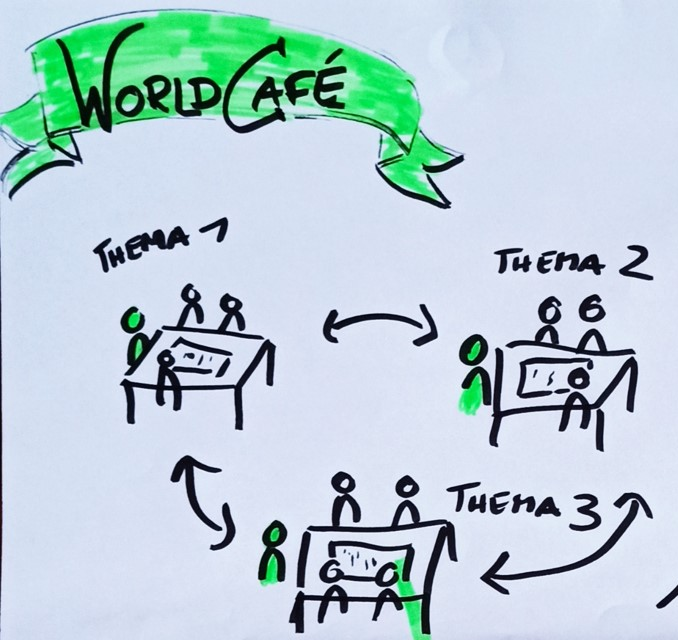

<!--

author:   Britta
email:    b.petersen@rz.uni-kiel.de
version:  0.0.1
language: de
narrator: Deutsch Female
title: Methode und Ablauf 

comment: Kurzbeschreibung des Ablaufes der Arbeitsphase, Community Event zur Lernzielmatrix FDM, Darmstadt 2024-01-31/2024-02-01

licence: 

logo: images/logos_dalia_dini-nestor.png

@style

.lia-slide__container {
    background-image: url("https://raw.githubusercontent.com/RDM4CAU/LZ4FDM/main/images/fdm-lehre.png");
    background-size: 15%;
    background-repeat: no-repeat;
    background-position: right top;
    opacity: 1;
}

@end

-->

# Community Meeting: Arbeitsphase 

> <big>**Kurzbeschreibung unser Ziele, Arbeitsaufträgen & dem Ablauf unserer Arbeitsphase**</big>
>
> *Community Event zur Lernzielmatrix*
> 
> Darmstadt, 2024-01-31 - 2024-02-30
>
> <!-- width="150px" -->

# Ziele für die Arbeitsphase

> * Diskussion und Überarbeitung der Tabellenstruktur 
>
>    * Durchsuchbarkeit, Übersichtlichkeit, Codierbarkeit
> * Diskussion der aufgeführten Inhaltsaspekte (in Clustern)
>
>   * Anpassungen und Erweiterungen 
>   * ggf. verbindende Elemente zu verwandten Themengebieten ergänzen?
> * Diskussion aufgeführter Lernziele
>
>   * Sprachliche wie inhaltliche Überarbeitung ungünstig formulierter Lernziele 
>
>   * Ergänzung weiterer Lernziele 
> * Korrektur von Fehlern 
> * ...

# Arbeitsaufträge 

> <big>**Bitte diskutiert in Euren jeweiligen Arbeitsgruppen:**</big>
>
> * ...

# Methode und Ablauf 

<!-- width="350px" align="right" -->

{{1-2}}
********************************************************************************

Wir möchten in einer Art World-Café mit Euch arbeiten.

**Ablauf**:

* Erläuterung der Methode World-Cafe 
* Vorstellung der Diskussionsthemen & der Gastgeber:innen.
* Verteilung an die Tische 
* Vorgegebenene Diskussions-/Arbeitszeit: 30 Min.
* Gastgeber:innen bleiben am Tisch
* Teilnehmende dürfen frei (?!) wählen, ob und zu welchem Thema sie wechseln wollen 

> **Rolle unserer Gastgeber:innen**: erläutern, anregen, begleiten, dokumentieren
>
> **Alle Teilnehmenden**: reflektieren, diskutieren, argumentieren, aktiv sein

********************************************************************************

{{2}}
********************************************************************************

**Unsere Gastgeber:innen und Diskussionsthemen**:

**Tisch 1**: 

**Tisch 2**: 

**Tisch 3**: 

**Tisch 4**: 

**Tisch 5**: 

**Tisch 6**: 

**Tisch 7**: 

**Tisch 8**: 

********************************************************************************

